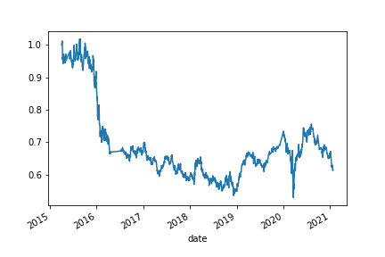

# Algo Trading - Comparing Strategy Returns with Various Methods (SMA, SVM, AdaBoost)

This Jupyter Notebook uses OHLC data to cerate, train and test algorithmic trading models. The models explored further in this notebook include SMA (simple moving average), SVM (support vector machine), and AdaBoost. 

## Technologies

This program is written in Python (3.7.13) and developed using Google Colab on a Windows computer. Additional libraries that are used in this application are pandas (1.3.5), matplotlib (3.5.1), scikitlearn (1.0.2), and numpy (1.21.5) (see parenthesis for versions used in program development).

## Installation Guide

Downloading the code & associated files using `git clone` from the repository is sufficient to download the Jupyter Notebook, ensure that the associated libaries (see Technologies section) are installed on your machine as well. If there are any issues with the library functions please refer to the versions used in development (see Technnologies section for this information as well).  Please note that this is a Jupyter notebook. 

## Usage

This notebook is referencing data stored in the Resources folder in the repository, `emerging_markets_ohlcv.csv`. OHLCV indicates that the table contains open, high, low, close, and volume data. The csv contains 4323 rows of data, the data is sampled throughout the day so take note that time time interval between the datapoints is not equivalent at all times. 

## Code examples

Rolling windows are used to generate fast and slow simple moving averages from the initial dataset. For example, the following code will create a 4-day simple moving average based on the closing prices in the dataset: 

```python
signals_df['SMA_Fast'] = signals_df['close'].rolling(window=4).mean()
```

Slow (window = 100) and fast (window = 4) time periods were used to calculate moving averages, which were then used to calculate trading signals to buy the stock long or sell the stock short. 

For the SVM (support vector machine) and AdaBoost models, the data was split into training and testing datasets. The training dataset contained data between (and including) `2015-04-02 15:00:00` until `2015-07-02 10:45:00`, and the testing dataset contained data between (and including) `2015-07-06 10:00:00` until `2021-01-22 15:45:00`. 

`StandardScaler()` instances were created to scale the data prior to fitting, and the models were instantiated with functions from `sklearn`: 

``` python
from sklearn.svm import SVC
svm_model = SVC()
```

```python
from sklearn.ensemble import AdaBoostClassifier
model = AdaBoostClassifier(n_estimators=100)
```

The model was fit on the training data and classification reports were created with the testing data, using the `sklearn` library as well: 

```python
report = classification_report(y_test, y_pred)
```

## Model results

Out of the three models tested, the SVM (support vector machine) model produces the highest rate of return at the end of the trading window, followed by the AdaBoost model (which actually exceeded the performace of the SVM model but went downhill after that), and then the model purely based on SMA (simple moving averages). 




## References

For more information about the libraries, check out the documentation!

[Pandas library](https://pandas.pydata.org/)

[Matplotlib library](https://matplotlib.org/)

[Numpy library](https://numpy.org/)

[Scikitlearn library](https://scikit-learn.org/stable/)

[Scikitlearn library - SVM](https://scikit-learn.org/stable/modules/svm.html)

[Scikitlearn library - AdaBoost](https://scikit-learn.org/stable/modules/ensemble.html#adaboost)

## Contributors

Project contributors are the Rice FinTech bootcamp program team (instructor Eric Cadena) who developed the tasks for this project along with myself (Paula K) who's written the code in the workbook.
